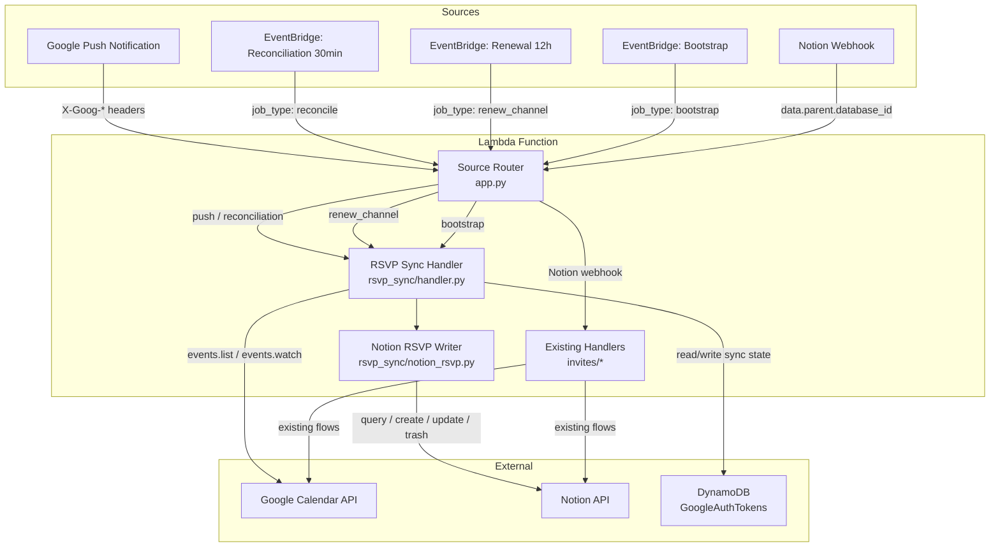
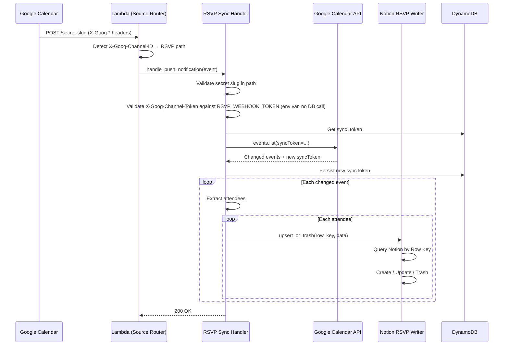

# Design Document: RSVP Sync

## Overview

This feature adds real-time Google Calendar RSVP status synchronization to the existing Lambda. When attendees respond to calendar events (accept, decline, tentative), the system writes those statuses to a dedicated Notion RSVP database. It uses Google Calendar push notifications for near-real-time updates, with scheduled reconciliation every 30 minutes and channel renewal every 12 hours.

The design extends the existing Lambda without modifying current Notion webhook handling. A source router at the top of `app.py` detects the invocation type and delegates accordingly.

### Key Design Decisions

1. **Single Lambda, multiple entry paths** — Reuses the existing Lambda and DynamoDB table rather than deploying a separate service. Reduces infrastructure cost and operational overhead.
2. **Secret slug + channel token dual validation** — Lambda Function URL uses `NONE` auth. Security is provided by an unguessable URL path segment plus a per-channel token validated on every push notification.
3. **Single DynamoDB item for sync state** — Stores sync token and channel metadata in the existing `GoogleAuthTokens` table under a fixed well-known partition key. No new tables needed.
4. **Notion API 2025-09-03 `in_trash: true`** — Uses the current Notion API version's trash mechanism instead of the deprecated `archived` flag.
5. **Idempotent writes by Row Key** — Every Notion write is keyed by `calendarId::eventId::emailAddress`, making concurrent or duplicate syncs safe.

## Architecture



### Request Flow: Push Notification



## Components and Interfaces

### 1. Source Router (`app.py`)

The existing `lambda_handler` is extended with detection logic at the top, before the current Notion webhook routing.

```python
def lambda_handler(event, context):
    # 1. Check for Google push notification (X-Goog-* headers)
    headers = event.get("headers") or {}
    if headers.get("x-goog-channel-id") and headers.get("x-goog-resource-id"):
        return rsvp_handler.handle_push_notification(event)

    # 2. Check for EventBridge scheduler jobs (read directly from event,
    #    not _parse_body — EventBridge sends payload as the top-level object)
    job_type = event.get("job_type")
    if job_type == "bootstrap":
        return rsvp_handler.handle_bootstrap()
    if job_type == "renew_channel":
        return rsvp_handler.handle_renew_channel()
    if job_type == "reconcile":
        return rsvp_handler.handle_reconciliation_sync()

    # 3. Existing Notion webhook routing (unchanged)
    ...
```

Detection order: Google push headers → `job_type` field → `data.parent.database_id` → 400 error.

### 2. RSVP Sync Handler (`rsvp_sync/handler.py`)

Orchestrator module exposing four public functions:

| Function | Trigger | Behavior |
|---|---|---|
| `handle_push_notification(event)` | Google push | Validate secrets → incremental sync → process events → write Notion |
| `handle_reconciliation_sync()` | EventBridge 30min | Incremental sync → process events → write Notion |
| `handle_renew_channel()` | EventBridge 12h | Stop old channel → create new channel → persist state |
| `handle_bootstrap()` | Manual/EventBridge | Full sync → create watch channel → persist state |

Internal helpers:
- `_validate_push(event) → bool` — Checks secret slug in path against `RSVP_WEBHOOK_SLUG` from config and validates X-Goog-Channel-Token against `RSVP_WEBHOOK_TOKEN` from config (env vars, no DynamoDB call on the hot path).
- `_run_incremental_sync() → list[dict]` — Calls `list_events_incremental`, falls back to `list_events_full` on 410.
- `_run_full_sync() → list[dict]` — Calls `list_events_full`.
- `_process_events(events) → list[AttendeeRecord]` — Extracts attendee data from changed events. Sets `remove=True` for all attendees of cancelled events.
- `_trash_removed_attendees(events) → None` — For each non-cancelled changed event, queries Notion for all existing rows with that Event ID, then trashes any row whose email is not in the current Google attendee list. This is the only way to detect attendees removed from an event, since Google's incremental sync does not report which specific attendees were removed.
- `_build_calendar_service() → service` — Loads credentials from DynamoDB and builds the Google Calendar service.

The sync flow uses two paths:
- **Path A (upsert):** For each attendee in each changed event → `upsert_or_trash` as designed. Handles creates, updates, and cancellation-based trashing.
- **Path B (removal detection):** For each non-cancelled changed event → query Notion for all rows with that Event ID → trash any whose email isn't in the current attendee list. This covers the "previously seen, now missing" case that can't be detected from the event payload alone.

### 3. Notion RSVP Writer (`rsvp_sync/notion_rsvp.py`)

Handles all Notion RSVP database interactions.

| Function | Signature | Behavior |
|---|---|---|
| `query_by_row_key(row_key)` | `str → Optional[dict]` | Query RSVP database filtering on Row Key rich_text property |
| `query_by_event_id(event_id)` | `str → list[dict]` | Query RSVP database for all rows with a given Event ID; used by `_trash_removed_attendees` to find rows whose attendees are no longer on the event |
| `create_rsvp_row(record)` | `AttendeeRecord → str` | Create new Notion page, return page ID |
| `update_rsvp_row(page_id, record)` | `(str, AttendeeRecord) → None` | Update existing page properties |
| `trash_rsvp_row(page_id)` | `str → None` | PATCH page with `in_trash: true` |
| `upsert_or_trash(record)` | `AttendeeRecord → None` | Orchestrates query → create/update/trash logic |

Uses the existing `adapters/notion_client.py` session and retry patterns. Adds a `query_database` helper for filtered queries.

### 4. Sync State Store (`adapters/sync_state_store.py`)

New adapter reusing patterns from `token_store.py`.

| Function | Signature | Behavior |
|---|---|---|
| `get_sync_state()` | `→ Optional[SyncState]` | Read the sync state DynamoDB item |
| `update_sync_token(token)` | `str → None` | Atomically update the sync_token field |
| `update_channel_state(channel_id, resource_id, expiration, channel_token)` | `(str, str, int, str) → None` | Persist watch channel metadata |
| `update_full_state(sync_token, channel_id, resource_id, expiration, channel_token)` | `(str, str, int, str, str) → None` | Persist all fields at once (bootstrap) |

Uses `boto3.client("dynamodb")` with `@on_exception(expo, ClientError, max_tries=3)` consistent with `token_store.py`.

### 5. Google Calendar Adapter Extensions (`adapters/google_calendar.py`)

Four new functions added to the existing module:

| Function | Signature | Behavior |
|---|---|---|
| `list_events_incremental(service, calendar_id, sync_token)` | `→ (list[dict], str)` | Paginated events.list with syncToken, returns (events, new_sync_token) |
| `list_events_full(service, calendar_id)` | `→ (list[dict], str)` | Paginated events.list without syncToken, returns (events, initial_sync_token) |
| `create_watch_channel(service, calendar_id, channel_id, webhook_url, token, ttl)` | `→ dict` | events.watch call |
| `stop_watch_channel(service, channel_id, resource_id)` | `→ None` | channels.stop call |

All use `@on_exception(expo, HttpError, max_tries=3, max_time=20)` matching existing patterns.

### 6. Configuration Extensions (`config.py`)

New environment variables appended to the existing config module:

```python
RSVP_CALENDAR_ID = os.getenv("RSVP_CALENDAR_ID")
NOTION_RSVP_DATASOURCE_ID = os.getenv("NOTION_RSVP_DATASOURCE_ID")
RSVP_WEBHOOK_SLUG = os.getenv("RSVP_WEBHOOK_SLUG")
RSVP_SYNC_STATE_KEY = os.getenv("RSVP_SYNC_STATE_KEY", "rsvp_sync_state")
RSVP_CHANNEL_TTL_SECONDS = int(os.getenv("RSVP_CHANNEL_TTL_SECONDS", "604800"))
RSVP_WEBHOOK_TOKEN = os.getenv("RSVP_WEBHOOK_TOKEN")
RSVP_FUNCTION_URL = os.getenv("RSVP_FUNCTION_URL")
```

## Data Models

### AttendeeRecord

Internal data class used to pass attendee data between handler and Notion writer.

```python
@dataclass
class AttendeeRecord:
    calendar_id: str
    event_id: str
    event_name: str          # event summary
    attendee_email: str
    display_name: str        # attendee displayName or email fallback
    rsvp_status: str         # accepted | declined | tentative | needsAction
    is_organizer: bool
    remove: bool = False     # True when attendee/event should be trashed

    @property
    def row_key(self) -> str:
        return f"{self.calendar_id}::{self.event_id}::{self.attendee_email}"
```

### SyncState

Internal data class for DynamoDB sync state.

```python
@dataclass
class SyncState:
    sync_token: Optional[str]
    channel_id: Optional[str]
    resource_id: Optional[str]
    channel_expiration: Optional[int]  # epoch millis
    channel_token: Optional[str]
```

### DynamoDB Item Schema

Stored in the existing `GoogleAuthTokens` table:

| Attribute | Type | Description |
|---|---|---|
| `client_id` (PK) | S | Fixed value from `RSVP_SYNC_STATE_KEY` config (default: `rsvp_sync_state`) |
| `sync_token` | S | Opaque Google Calendar sync token |
| `channel_id` | S | UUID of the active watch channel |
| `resource_id` | S | Google-assigned resource ID for the channel |
| `channel_expiration` | N | Channel expiry as epoch milliseconds |
| `channel_token` | S | Cryptographically random token for push validation |

### Notion RSVP Database Row Properties

| Notion Property | Type | Source |
|---|---|---|
| Name | title | `attendee.displayName` or email fallback |
| Row Key | rich_text | `calendarId::eventId::emailAddress` |
| Event ID | rich_text | Google Calendar event ID |
| Event Name | rich_text | Google Calendar event summary |
| Attendee Email | email | `attendee.email` |
| RSVP Status | select | `accepted` / `declined` / `tentative` / `needsAction` |
| Is Organizer | checkbox | `attendee.organizer` flag |


## Correctness Properties

*A property is a characteristic or behavior that should hold true across all valid executions of a system — essentially, a formal statement about what the system should do. Properties serve as the bridge between human-readable specifications and machine-verifiable correctness guarantees.*

### Property 1: Source routing correctness

*For any* incoming Lambda event, the source router SHALL select exactly one handler path determined by the event's distinguishing fields: events with `X-Goog-Channel-ID` and `X-Goog-Resource-ID` headers route to the RSVP push handler; events with `job_type` in `{bootstrap, renew_channel, reconcile}` route to the corresponding job handler; events with `data.parent.database_id` route to the existing Notion handler; and all other events return HTTP 400. Note: `job_type` is read directly from the top-level event object (not from `_parse_body`), since EventBridge sends its payload as the top-level event.

**Validates: Requirements 1.1, 1.2, 1.3, 1.4, 1.5, 1.6, 11.1**

### Property 2: Push notification validation

*For any* incoming push notification event with a URL path and a channel token header, the validation function SHALL return success if and only if the URL path contains the configured secret slug AND the channel token header matches the `RSVP_WEBHOOK_TOKEN` environment variable (validated from config, not DynamoDB). All other combinations SHALL be rejected with HTTP 403.

**Validates: Requirements 2.1, 2.2, 2.3, 2.4**

### Property 3: Attendee extraction correctness

*For any* list of Google Calendar event objects, the extraction function SHALL produce one `AttendeeRecord` per attendee in non-cancelled events with an `attendees` array, with `remove=True` for all attendees of cancelled events, and zero records for events with no `attendees` array. Each record SHALL contain the correct `email`, `display_name`, `rsvp_status`, `is_organizer`, `event_id`, and `event_name` fields.

**Validates: Requirements 4.1, 4.2, 4.4**

### Property 3b: Removed attendee detection

*For any* non-cancelled changed event with a set of current attendees, and any set of existing Notion rows for that event's Event ID, the `_trash_removed_attendees` function SHALL trash exactly those Notion rows whose attendee email is not present in the current Google attendee list, and SHALL not trash any row whose email is present.

**Validates: Requirement 4.3**

### Property 4: Row Key round-trip

*For any* valid `calendar_id`, `event_id`, and `attendee_email` (none containing the `::` separator), constructing a Row Key and parsing it back SHALL yield the original three components.

**Validates: Requirements 5.1**

### Property 5: Upsert decision correctness

*For any* `AttendeeRecord` and any existing Notion database state (no existing row, existing row with same status, existing row with different status, or record marked for removal with existing row), the `upsert_or_trash` function SHALL perform exactly one of: create (when no row exists and `remove=False`), update (when row exists and status differs), trash (when `remove=True` and row exists), or no-op (when row exists and status matches, or `remove=True` and no row exists).

**Validates: Requirements 5.2, 5.3, 5.4**

### Property 6: Idempotent writes

*For any* `AttendeeRecord`, processing it through `upsert_or_trash` twice in sequence SHALL produce the same Notion database state as processing it once. The second invocation SHALL result in a no-op (no create, no update, no trash).

**Validates: Requirements 5.5, 8.3**

## Error Handling

### Google Calendar API Errors

| Error | Handling |
|---|---|
| HTTP 410 Gone (invalid sync token) | Fall back to full sync, persist new token |
| HTTP 404 on channels.stop | Log warning, continue with new channel creation |
| Any `HttpError` | Retry with exponential backoff (3 attempts, 20s max) via `@on_exception` |

### Notion API Errors

| Error | Handling |
|---|---|
| HTTP 429 Rate Limit | Retry with exponential backoff (3 attempts, 30s max) via `@on_exception` |
| Any `RequestException` | Retry with exponential backoff (3 attempts, 30s max) |
| Row not found on trash | Log warning, skip (already removed) |

### DynamoDB Errors

| Error | Handling |
|---|---|
| `ClientError` | Retry with exponential backoff (3 attempts, 10s max) via `@on_exception`, consistent with `token_store.py` |

### Validation Errors

| Error | Handling |
|---|---|
| Missing/invalid secret slug | Return HTTP 403, log rejection |
| Missing/invalid channel token | Return HTTP 403, log rejection |
| Unrecognized event type | Return HTTP 400, log event type |
| Google `sync` ping (resource-state=sync) | Return HTTP 200 immediately, no processing |

## Testing Strategy

### Property-Based Tests (using Hypothesis)

Each correctness property maps to one property-based test with minimum 100 iterations.

| Test | Property | Approach |
|---|---|---|
| `test_source_routing` | Property 1 | Generate random event dicts with varying header/field combinations. Mock handler functions. Verify correct handler is called. Tag: `Feature: rsvp-sync, Property 1: Source routing correctness` |
| `test_push_validation` | Property 2 | Generate random (slug, token, stored_slug, stored_token) tuples. Verify validation result matches expected boolean. Tag: `Feature: rsvp-sync, Property 2: Push notification validation` |
| `test_attendee_extraction` | Property 3 | Generate random lists of Google Calendar event dicts with varying attendee arrays, statuses, and missing fields. Verify extracted records match expected output. Tag: `Feature: rsvp-sync, Property 3: Attendee extraction correctness` |
| `test_removed_attendee_detection` | Property 3b | Generate random sets of current Google attendees and existing Notion rows for an event. Verify exactly the correct rows are trashed. Tag: `Feature: rsvp-sync, Property 3b: Removed attendee detection` |
| `test_row_key_round_trip` | Property 4 | Generate random (calendar_id, event_id, email) tuples without `::`. Verify `parse(build(x)) == x`. Tag: `Feature: rsvp-sync, Property 4: Row Key round-trip` |
| `test_upsert_decision` | Property 5 | Generate random AttendeeRecords and random existing Notion states. Mock Notion API. Verify correct operation (create/update/trash/no-op). Tag: `Feature: rsvp-sync, Property 5: Upsert decision correctness` |
| `test_idempotent_writes` | Property 6 | Generate random AttendeeRecords. Mock Notion API with stateful fake. Process twice, verify state is identical. Tag: `Feature: rsvp-sync, Property 6: Idempotent writes` |

### Unit Tests (example-based)

| Test | Requirement | Approach |
|---|---|---|
| `test_sync_ping_returns_200` | 2.5 | Send push with resource-state=sync, verify 200 and no sync |
| `test_410_triggers_full_sync` | 3.3 | Mock Calendar API to return 410, verify full sync fallback |
| `test_pagination_all_pages` | 3.5 | Mock 3-page response, verify all events collected and final sync token captured |
| `test_retry_on_429` | 5.6 | Mock Notion 429 response, verify 3 retries |
| `test_stop_channel_failure_continues` | 7.4 | Mock channels.stop 404, verify new channel still created |
| `test_random_channel_token` | 7.5 | Generate token, verify length and uniqueness |
| `test_bootstrap_with_existing_channel` | 11.4 | Pre-populate state, verify old channel stopped |
| `test_bootstrap_response_summary` | 11.5 | Run bootstrap, verify response contains event count and channel ID |
| `test_removed_attendee_detection` | 4.3 | Provide a changed event with current attendees and mock Notion rows with extra emails, verify the extra rows are trashed |

### Integration Tests

| Test | Requirements | Approach |
|---|---|---|
| `test_incremental_sync_persists_token` | 3.1, 3.2 | Mock Calendar API, verify sync token read from and written to DynamoDB |
| `test_full_sync_no_token` | 3.4 | Mock Calendar API, verify no syncToken param |
| `test_sync_state_fields` | 6.1, 6.2 | Write sync state, read back, verify all fields present with correct PK |
| `test_channel_renewal_flow` | 7.1, 7.2, 7.3 | Mock Calendar API, verify stop → watch → persist sequence |
| `test_reconciliation_triggers_sync` | 8.1, 8.2 | Mock Calendar API, verify incremental sync is triggered |
| `test_bootstrap_full_flow` | 11.2, 11.3 | Mock Calendar API, verify full sync + channel creation + state persistence |
| `test_config_env_vars` | 10.1-10.7 | Set env vars, verify config module values |

### Test Configuration

- Property-based testing library: **Hypothesis** (Python)
- Minimum iterations per property test: **100** (Hypothesis default `max_examples=100`)
- All Google Calendar and Notion API calls are mocked in unit/property tests
- DynamoDB calls use mocked boto3 client or `moto` library
